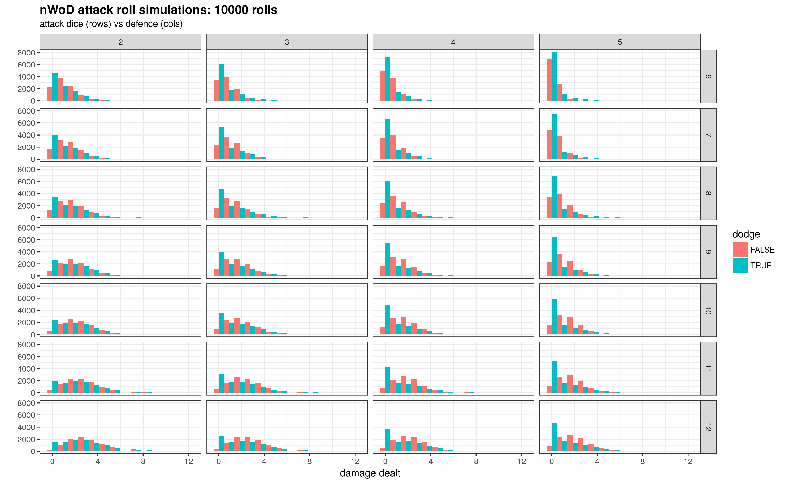

# (new) World of Darkness simulations

Simulating die rolls for the pen and paper roleplaying system (new) World of Darkness. 

# Results

Dodge performs better if there is a larger difference between attack dice and defence *and* you have a "large enough" defence to begin with. Dodging "frontloads" the results with 0 attack successes, at the (theoretical) higher chance of high-damage attacks. 

